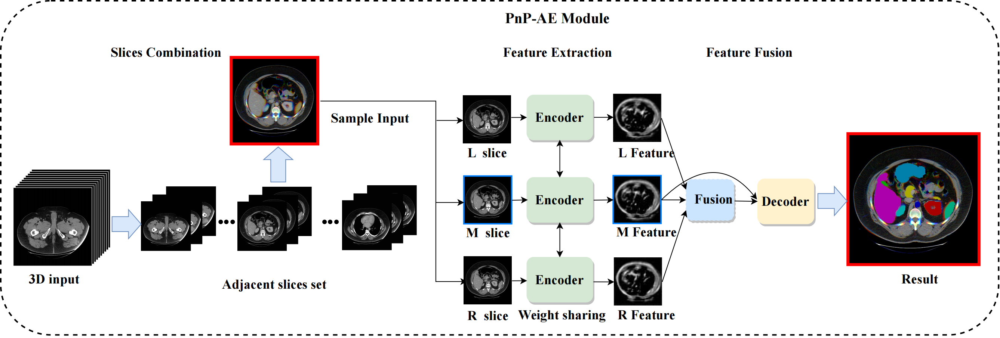

# PnP-AE
The codes for the work "PNP-AE: A PLUG-AND-PLAY MODULE FOR VOLUMETRIC MEDICAL IMAGE
- 

## 1. Prepare data
- BTCV
      - The datasets we used are provided by TransUnet's authors. Please go to ["./datasets/README.md"](datasets/README.md) for details, or please send an Email to jienengchen01 AT gmail.com to request the preprocessed data. If you would like to use the preprocessed data, please use it for research purposes and do not redistribute it (following the TransUnet's License).
- ACDC
      - [ACDC-official](https://acdc.creatis.insa-lyon.fr/description/databases.html)

## 2. Environment

- Use the command "pip install -r requirements.txt" for the dependencies.

## 3. Train/Test

- See annotations below train.py

## 4. Supported models (Welcome to add new 2D neworks)
- √ U-Net
- √ U-Net++
- √ SwinUNet
- √ MissFormer
- √ TransUNet
